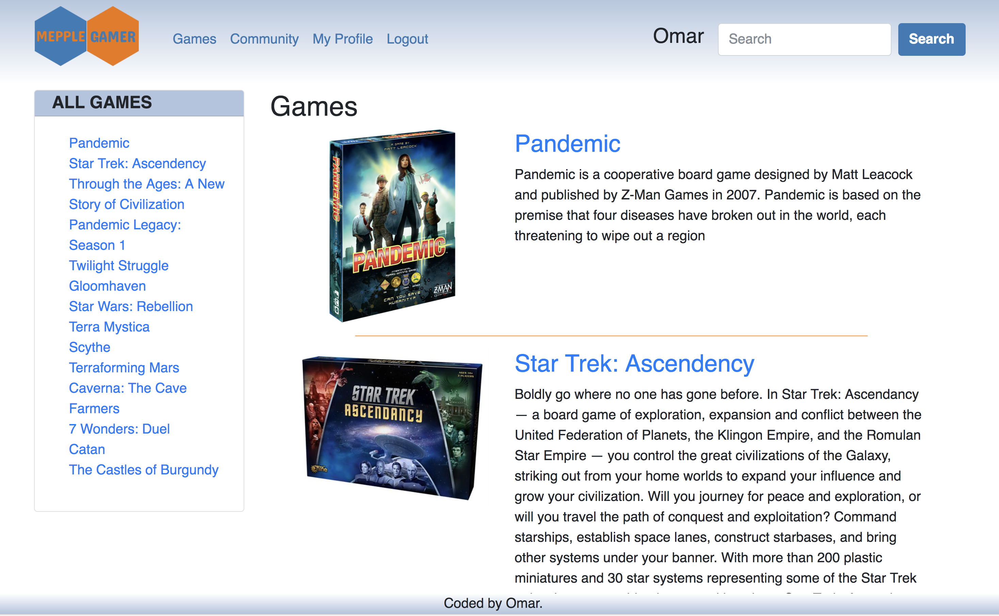
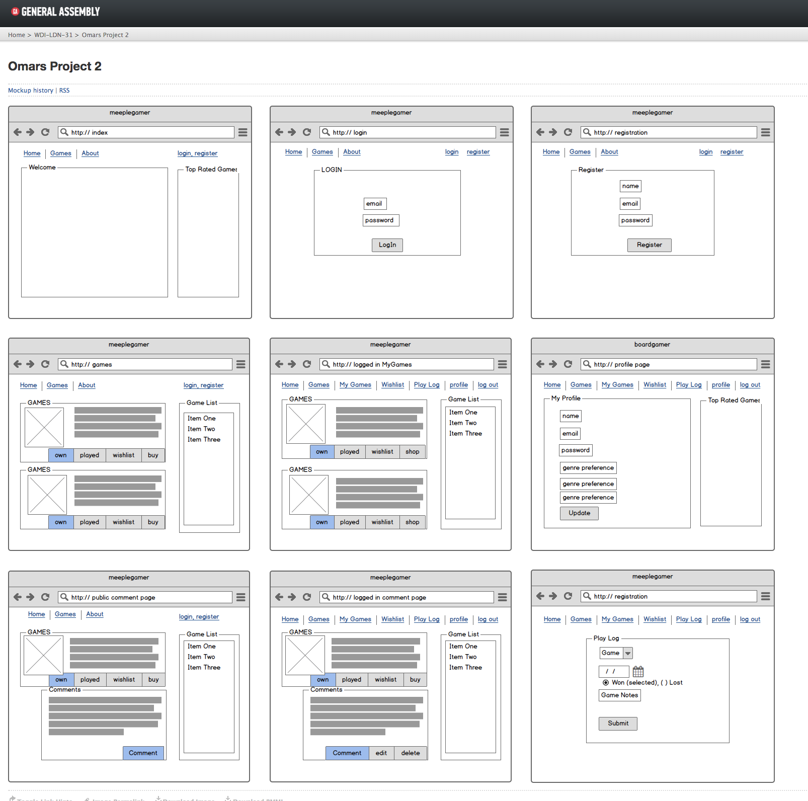
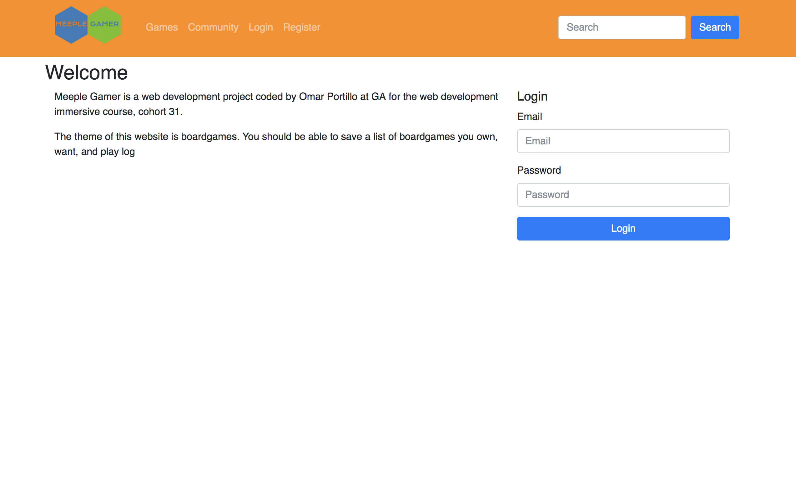

## Meeple Gamer

<figure>
  
  <figcaption>This is my second project at GA: it is a board game hub, where you can explore board games, track board games you own, add them to a wish list, log your game plays, and comment on board games.</figcaption>
</figure>

### Project Brief

Your app must:

* **Have at _least_ 2 models** – one representing a user and one that represents the main resource of your app, e.g. Restaurants
* **Incude relationships** - embedded or referenced. Make sure you take the time to consider the best approach before building out your models.
* **The app should include authentication** - with hashed passwords & an authorization flow.
* **Have complete RESTful routes** for at least one of your resources with all CRUD actions.
* **You must use SCSS** - as this is a key industry skill.
* **You should use a CSS framework that has a grid system** - even if the grid is the only part you use from the framework, it is fundamental that you get to grips with rows and columns.
* **Include wireframes** - that you designed before building the app.
* Have **semantically clean HTML** - you make sure you write HTML that makes structural sense rather than thinking about how it might look, which is the job of CSS.
* **Be deployed online** and accessible to the public.

### Bonus
* **Include data from an API** - to make your app more dynamic, add some data from an API. You might need to consider CORS issues with AJAX and/or the need to store this external data in your app.

### Installation and setup

#### Run Locally
- Download or clone the [Github repo](https://github.com/omrprt/wdi-first-project)
- Run `gulp` in the terminal to compile the source code and open in the browser
- Seed `node db/seeds.js` in the terminal to load the seed file.

#### View Online

- [View on Heroku](https://meeplegamer.herokuapp.com/)
- [View on Github](https://github.com/omrprt/wdi-second-project)

### Approach Taken

1. I started with a very short brain storming session a system that will
2. Worked on the wireframe.
3. Worked on the file structure.
4. Worked on the RESTful routes.
5. Coded the EJS pages
6. Added styling using scss
7. Had UX feedback.
8. looped again and again.

<figure>
  
  <figcaption>Wireframed using Balsamiq</figcaption>
</figure>

### Technologies used

To create this project I used the following technologies:

### Dependencies
- bcrypt
- bluebird
- body-parser
- ejs
- express
- express-ejs-layouts
- express-flash
- express-session
- method-override
- mongoose
- morgan

###Others

- HTML5
- SCSS
- Javascript (ECMAScript 6)
- jQuery
- Git
- Github
- Heroku
- Atom
- GIMP
- GULP
- https://balsamiq.com/
- https://trello.com/
- https://fonts.google.com/
- https://uigradients.com/
- https://coolors.co/
- https://logomakr.com/
- http://fontawesome.io/

### Challenges Faced

-Drying up the code
-Populating nested schemas
-Choosing a user friendly styling

<figure>
  
  <figcaption>Original color template</figcaption>
</figure>

### Where next?

How can the app be extended and improved:

- making some of the schema's editable:
 * currently can't update profile information
 * currenlty can't delete play log

- upload files:
  * Add a upload file features, for pictures.

- Improving the code:
  * I am certain that there are areas of my code to be more efficient and dryer.
  * the code could be refactored further.

- Improve user experience:
  * Futher improve how information is presented in order to have a better user experience.
  * Friend people
  * Add a introduction to board game view.

- Utilize APIs:
  * Would like to include an Amazon and Ebay API.

## Acknowledgments
* Would like to thank my instructors at GA, and classmates.
* It was inspired by my enjoyment of board games.
* Thanks to Robert, Brian and Josh for their feedback.
* Seed data information was sourced from BoardGameGeek, Amazon, Wikipedia.
